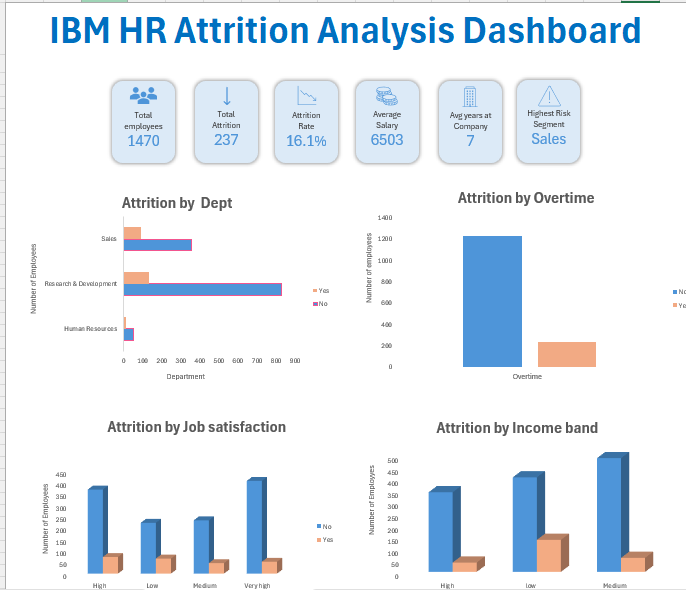

IBM HR Attrition Analysis — Excel Dashboard
An interactive Excel dashboard analyzing employee attrition patterns across 1,470 employees using the IBM HR Analytics dataset from Kaggle.

Key Business Findings
MetricValueTotal Employees1,470Total Attrition237Attrition Rate16.1%Average Salary$6,503Average Years at Company7Highest Risk SegmentSales
Top Insights:

Sales department has the highest attrition rate (21%), indicating potential workload or management concerns
Overtime employees are significantly more likely to leave compared to non-overtime employees
Mid-income band employees exhibit the highest attrition concentration
Average tenure of leaving employees is below the company average, suggesting early stage dissatisfaction

Dashboard Features
KPI Cards
Six summary cards at the top of the dashboard displaying the most critical HR metrics at a glance — total headcount, attrition count, attrition rate, average salary, average tenure, and highest risk segment.
Interactive Slicers
The dashboard can be filtered dynamically by:

Gender (Male / Female)
Department (Human Resources / Research & Development / Sales)
Job Role (Laboratory Technician, Research Scientist, Sales Executive, and more)

All charts update automatically when slicers are applied.

Charts Included
ChartTypeInsightAttrition by DepartmentHorizontal BarSales leads attrition across all departmentsAttrition by OvertimeClustered ColumnOvertime employees leave at a much higher rateAttrition by Job SatisfactionClustered ColumnLow satisfaction correlates strongly with attritionAttrition by Income BandClustered ColumnMid-income band shows highest attrition volumeAttrition by Tenure BandHorizontal BarEarly stage employees show the highest attrition risk

Workbook Structure
IBM_HR_Attrition_Dashboard.xlsx
│
├── HR Dashboard     — Interactive dashboard with KPI cards, charts and slicers
├── Raw_Data         — Original IBM HR dataset (1,470 rows)
└── Pivot_Backend    — Pivot tables powering all dashboard charts

Excel Skills Demonstrated

Pivot Tables for data aggregation and summarization
Pivot Charts (Clustered Column, Horizontal Bar)
Slicers connected to multiple charts for dynamic filtering
KPI summary cards using cell formatting
IF formulas for custom grouping (Tenure Band classification)
Dashboard layout and design

Dataset Source
IBM HR Analytics Employee Attrition & Performance — Kaggle

About

I'm Spandana Perni, a Recruitment Operations Analyst at Randstad India supporting Microsoft's US hiring operations. This project demonstrates Excel dashboard skills applied to HR analytics and workforce planning.
